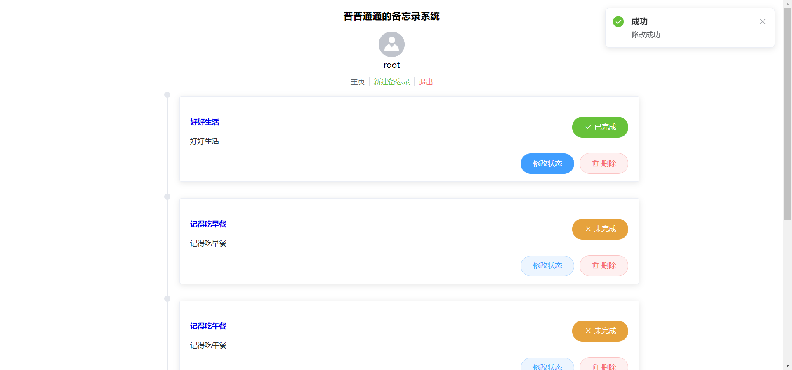

# ✨备忘录系统（SpringBoot + Vue）

普普通通的备忘录系统...

 

# ✨界面展示

 

# ✨项目结构

- sql => 数据库
- memo-java => 后端
- memo-vue => 前端

 

# ✨开发环境

- MySQL 5.7
- JDK 8

 

# ✨技术栈

## 前端

- vue2
- Element UI

 

## 后端

- SpringBoot
- MybatisPlus